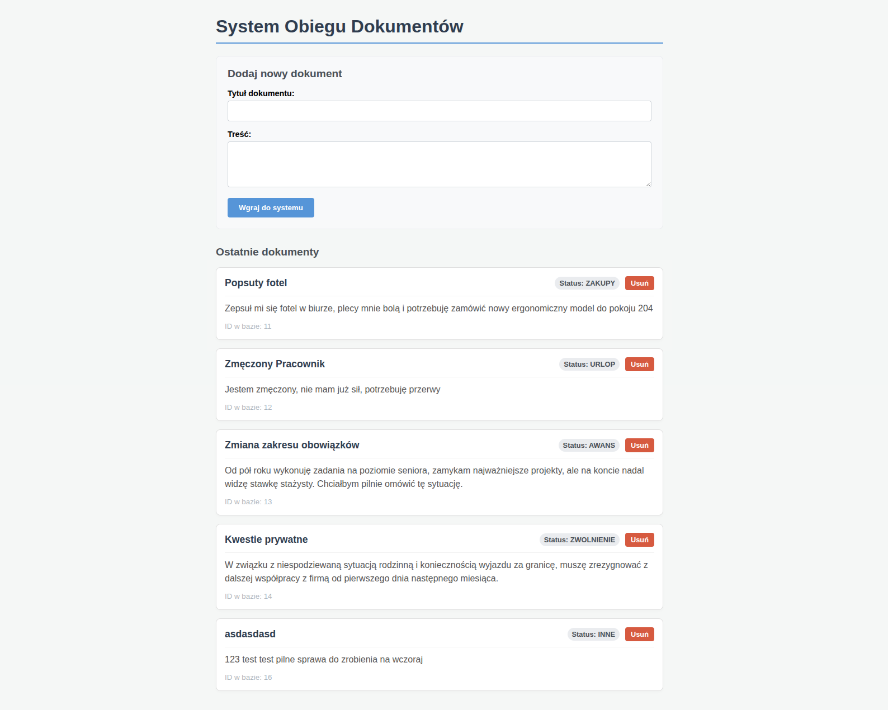

# Document Flow System (Full-Stack ECM PoC)



A Proof of Concept for an Enterprise Content Management (ECM) system, built with a modern, decoupled full-stack architecture. The system utilizes Artificial Intelligence to automatically classify document metadata on the fly before persisting it to a relational database.

## System Architecture
* **Backend:** Spring Boot 3.x (REST API, Spring Data JPA)
* **Frontend:** Angular 20 (Standalone Components, modern control flow)
* **Database:** PostgreSQL (Dockerized)
* **AI Integration:** Google Gemini API (2.5 Flash model)

## Repository Structure
This monorepo is divided into two independent projects:
* `/backend` - Java-based RESTful API with AI logic.
* `/frontend` - TypeScript-based Web Client.
* `/screenshots` - Project visual documentation.

## Getting Started

To run the complete system locally, you need to spin up the database, the backend server, and the frontend dev server.

### 1. Database
Navigate to the `backend` directory and start the PostgreSQL container:
```bash
cd backend
docker compose up -d
```

### 2. Backend Server
From the backend directory, start the Spring Boot application:
```bash
./mvnw spring-boot:run
```

### 3. Frontend Application
Open a new terminal, navigate to the frontend directory, install dependencies, and start the Angular server:
```bash
cd frontend
npm install
npm start
```
The web interface will be available at http://localhost:4200
